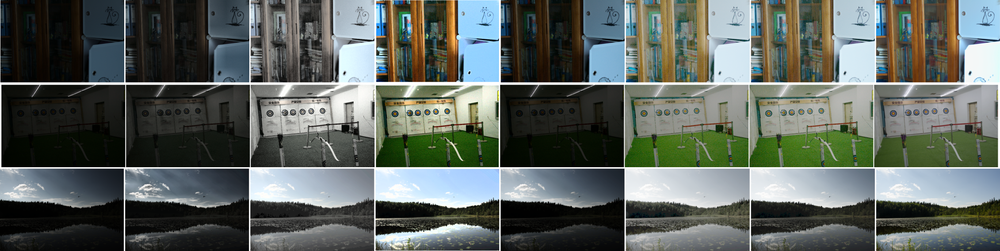
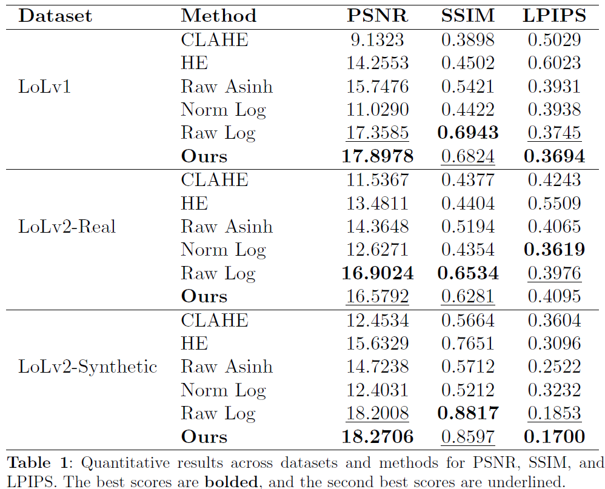

# Low-Light Image Enhancement via Adaptive Logarithmic Asinh Transformation Tuned by PSO-Based Entropy Optimization

## Abstract

---

Low-light images often suffer from poor visibility and a loss of detail due to
challenging environmental conditions or suboptimal imaging devices. This degradation
negatively impacts the performance of many vision tasks and algorithms
that are designed for high-quality inputs. Over time, numerous studies have proposed
methods to address this issue; however, many of these methods struggle
with non-uniform dark regions, leading to uneven illumination and amplified
noise in the processed images. In this study, we propose a novel method for lowlight
image enhancement that adapts to varying illumination levels by employing
an inverse hyperbolic sine (asinh) transformation applied to individual RGB
channels to account for non-uniform illumination changes. This transformation
incorporates an adaptive enhancement factor, α, which dynamically determines
whether a region should undergo linear or logarithmic scaling. The optimal value
of α is obtained using Particle Swarm Optimization (PSO) to maximize the
entropy of the enhanced grayscale image. After addressing varying illumination
levels with the asinh transformation, we apply a logarithmic transformation to
further enhance overall brightness. Both quantitative and qualitative evaluations
on various referenced low-light image datasets demonstrate the effectiveness and
generalizability of the proposed method.


## Installation

---

```bash
pip install -r requirements.txt
```


## Usage

---

### 🧾 Arguments

| Argument           | Description                                                                 |
|--------------------|-----------------------------------------------------------------------------|
| `-dataset_path`    | Path to dataset folder containing `Normal/` and `Low/` subfolders.          |
| `-image_pair_path` | Path to folder with `Normal/` and `Low/` containing one image pair.         |
| `image_name`       | Image filename (without extension) for single image pair processing.        |
| `-output_path`     | Path to save the enhanced image(s).                                         |

### 📁 Folder Structure Requirements

Whether running on a dataset or a single image pair, your folder must be structured like this:

```
<dataset_path>/
├── Normal/
│   ├── 1.png
│   └── ...
└── Low/
    ├── 1.png
    └── ...
```


### 🔹 To process a dataset

```bash
python main.py -dataset_path datasets/lolv1/Test -output_path output/lolv1
```

### 🔹 To process a single image pair

```bash
python main.py -image_pair_path datasets/lolv1/Test 1 -output_path output/image
```

---

## Results

---

### 🖼️ Qualitative Results


**Qualitative Results**: Top to bottom: samples from LoLv1, LoLv2-Real and LoLv2-Synthetic
datasets. From left to right: Low light image, CLAHE image, HE image, Raw Asinh
image, Norm Log image, Raw Log image, Proposed image, and Ground truth image.

### 📊 Quantitative Results

